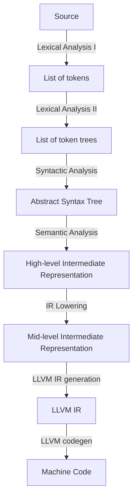

# Architecture

Crawfish is a compiler for a statically-typed language. It uses a materializing pipeline architecture: each stage produces a complete data structure consumed by the next. Each pass accepts its input and produces a *new* output rather than mutating the input in place.

## Code Map

Entry point: `main.rs` -> `driver.rs::compile()` orchestrates the full pipeline.

### Stage 1: Lexical Analysis (`front_end/lexical_analysis/`)

| What | Where |
|---|---|
| Tokenizer | `tokenizer.rs` -> `Tokenizer::tokenize()` |
| Token types | `token.rs` |
| Token tree parser | `token_tree_parser.rs` -> `TokenTreeParser::parse()` |
| Token tree types | `token_tree.rs` |

Source -> tokens -> token trees. Token trees validate delimiter balancing before parsing and bound error recovery to delimited regions. See [lexical-analysis.md](lexical-analysis.md).

### Stage 2: Syntactic Analysis (`front_end/syntactic_analysis/`)

| What | Where |
|---|---|
| Parser | `parser.rs` -> `Parser::parse()` |
| AST | `ast.rs` -> `Ast` |
| Handle types (typed and untyped) | `ast/handles.rs` |
| AST nodes, operator types, typed ID aliases | `ast/nodes.rs` |

Hand-written recursive descent parser with Pratt parsing for expressions. The AST uses a Structure of Arrays (SoA) layout with 32-bit handles. See [syntactic-analysis.md](syntactic-analysis.md).

### Stage 3: Semantic Analysis (`front_end/semantic_analysis/`)

| What | Where |
|---|---|
| Semantic Analyzer | `semantic_analyzer.rs` -> `SemanticAnalyzer::analyze()` |
| HIR | `hir.rs` -> `Hir` |
| Type system (`Ty` enum, `TypeInterner`) | `types.rs` |
| Unification table (union-find) | `unification_table.rs` |
| Symbol table (scoped name -> binding map) | `symbol_table.rs` |
| Constraint types and provenances | `constraints.rs` |

Three-phase algorithm: (1) walk AST, build HIR, collect constraints using bidirectional typing; (2) solve constraints via Robinson's unification; (3) substitute resolved types into the HIR. See [semantic-analysis.md](semantic-analysis.md).

### Stage 4: MIR Lowering (`middle_end/`)

| What | Where |
|---|---|
| MIR types (SSA CFG with block parameters) | `mir.rs` |
| Lowerer (HIR -> MIR via Braun SSA construction) | `lowerer.rs` |

The MIR is a flat, typed, target-independent SSA control-flow graph. It uses block parameters instead of phi nodes (following Cranelift/MLIR). SSA construction uses the Braun et al. algorithm.

### Common (`common/`)

| What | Where |
|---|---|
| Byte-range spans | `span.rs` |
| String interner + `Symbol` handle | `string_interner.rs` |
| Pre-interned built-in type name symbols | `preinterned_symbols.rs` |

### Diagnostics (`diagnostics/`)

| What | Where |
|---|---|
| Delimiter errors (unbalanced brackets) | `delimiter_diagnostics.rs` |
| Syntax errors | `syntactic_diagnostics.rs` |
| Type / name resolution errors | `semantic_diagnostics.rs` |

## Design Patterns

- **Immutable pass outputs** Each stage produces a new data structure. No stage mutates its input.
- **Error boundaries** Diagnostics (rendered using the `ariadne` crate) are collected in a list per stage. If a stage has errors, the compiler emits the diagnostics and stops, instead of feeding bad data forward ([source](https://www.reddit.com/r/Compilers/comments/1706jts/comment/k3k5onq/)).
- **Resilience** Each stage continues after errors (error tokens, error AST nodes, error binding handles and error type handles) to report as many errors as possible in one pass.
    - **Lexer**: emits error tokens for invalid characters
    - **Token tree parser**: reports delimiter mismatches
    - **Parser**: synchronizes at statement boundaries, inserts error AST nodes
    - **Semantic analyzer**: poisons with `BindingId::ERROR` and `error_id`
- **Interning everywhere** Strings are interned as `Symbol` handles; types are interned as `TypeId` handles. Equality is always a `u32` comparison.
- **Handle-based data structures**: the AST, HIR, MIR, type interner, string interner all use 32-bit handles rather than pointers or references. This gives compact representations, trivial equality checks, and cache-friendly access patterns.
- **Compiler context** `CompilerContext` in `driver.rs` bundles shared state (`StringInterner`, `TypeInterner`) threaded through all compilation stages (see Cranelift's `Context` and rustc's `TyCtxt`).

## Reference Docs

- [lexical-analysis.md](lexical-analysis.md): Tokens, token trees, interning, error recovery
- [syntactic-analysis.md](syntactic-analysis.md): AST design, recursive descent, Pratt parsing with worked example, error recovery
- [semantic-analysis.md](semantic-analysis.md): Symbol table, types, unification, bidirectional typing, three-phase algorithm
