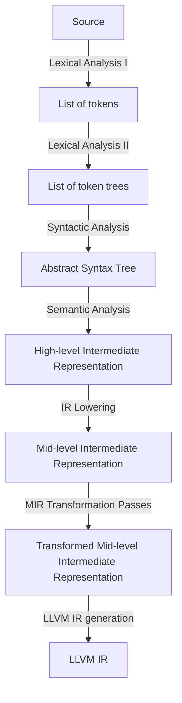

# ARCHITECTURE

Crawfish is a compiler for a statically-typed language. Each stage produces a complete, immutable data structure consumed by the next.

`main.rs`: orchestrates the pipeline.

**Lexical analysis** (`front_end/lexical_analysis/`): Two sub-stages. The tokenizer produces a flat token list; the token tree parser groups tokens by delimiters. Token trees exist so that delimiter balancing is validated before parsing and error recovery is bounded to delimited regions.

**Syntactic analysis** (`front_end/syntactic_analysis/`): Recursive descent with Pratt parsing for expressions. Produces an AST in SoA layout with 32-bit handles.

**Semantic analysis** (`front_end/semantic_analysis/`): Lowers AST to a typed HIR in three phases: (1) walk the AST, build the HIR, and collect type constraints using bidirectional typing; (2) solve constraints via unification; (3) substitute resolved types back into the HIR.

**MIR lowering** (`middle_end/`): Lowers HIR to a flat, target-independent SSA control-flow graph. Uses block parameters instead of phi nodes (following Cranelift/MLIR). SSA construction uses the Braun et al. algorithm.

**MIR transformation passes** (`middle_end/`): Read-only and rewriting passes over the freshly-lowered CFG, run before codegen: alias resolution (flushes the temporary aliases SSA construction introduces during trivial-phi elimination), verification, const-checking.

**Common** (`common/`): Byte-range spans, string interner, pre-interned built-in symbols.

**Diagnostics** (`diagnostics/`): One diagnostic type per stage, all rendered through `ariadne`.

