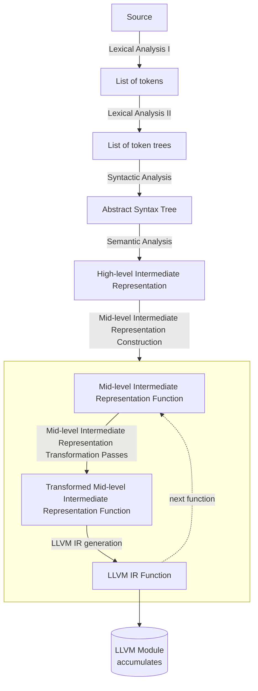

# ARCHITECTURE

- **Lexical Analysis** (`front_end/lexical_analysis/`)
  - **Lexical Analysis I**: the tokenizer produces a flat token list.
  - **Lexical Analysis II**: the token tree parser groups tokens by delimiters. Token trees exist so that delimiter balancing is validated before parsing and error recovery is bounded to delimited regions. 
  
  See [notes/lexical-analysis.md](notes/lexical-analysis.md).

- **Syntactic Analysis** (`front_end/syntactic_analysis/`): Recursive descent with Pratt parsing for expressions. Produces an AST in SoA layout with 32-bit handles. See [notes/syntactic-analysis.md](notes/syntactic-analysis.md).

- **Semantic Analysis** (`front_end/semantic_analysis/`): Lowers AST to a typed HIR in three phases: (1) walk the AST, build the HIR, and collect type constraints using bidirectional typing (2) solve constraints via unification (3) substitute resolved types back into the HIR. See [notes/semantic-analysis.md](notes/semantic-analysis.md).

- **MIR Construction** (`middle_end/ssa_constructor.rs`, `middle_end/lowerer.rs`): Lowers every HIR function to a MIR function whose body is a target-independent SSA control-flow graph. Uses block parameters instead of phi nodes (following Cranelift/MLIR). SSA construction follows the Braun et al. algorithm. See [notes/mir-construction.md](notes/mir-construction.md).

- **MIR Transformation Passes** (`middle_end/`): Read-only and rewriting passes over the freshly-lowered function's body.
  - **SSA Form Verification**: See [notes/ssa-form-verification.md](notes/ssa-form-verification.md).
  - **Const Checking**:
  - **Const Evaluation**:

- **LLVM IR Generation**: See [notes/llvm-ir-generation.md](notes/llvm-ir-generation.md).

- **Driver** (`driver/`): orchestrates the compilation process and handles command-line arguments.

- **Common** (`common/`): Byte-range spans and interners.

- **Diagnostics** (`diagnostics/`): One diagnostic type per stage, rendered through `ariadne`.