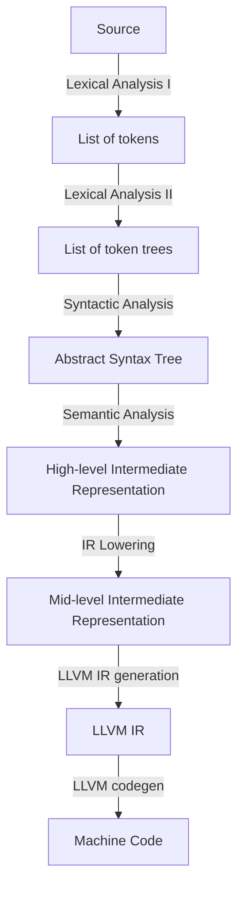

# ARCHITECTURE

## Common Architectures and Compilation Models

Compilers typically follow one of two architectures:
- **Pipeline-based Architecture**: Compilation is organized as a sequence of discrete phases, where the output of one phase becomes the input of the next. Data flows in one direction through the pipeline, and each phase has no knowledge of what came before or after it.
    - **Streaming Architecture**: Compilation stages communicate through function calls, processing data incrementally. No complete intermediate representation is ever fully materialized in memory. For instance, a token or AST node is passed forward and processed as soon as it is produced.
    - **Materializing Architecture**: Each compilation phase produces a complete data structure that is then consumed by the next phase in a clear, sequential flow. For example, the lexer fully produces a token list, which the parser then fully consumes to produce a complete AST, which the type checker then fully consumes, and so on.
- **Query-based Architecture**: Computations are expressed as queries that pull the information they need on demand. Each query (e.g. "what is the type of this expression?") is answered by invoking other queries recursively, and results are memoized so that redundant work is avoided.

The pipeline architecture typically lends itself to **batch compilation**, which involves the compiler processing an entire compilation unit from start to finish in one go, while the query-based architecture naturally supports **incremental compilation** model: when a source file changes, only the queries whose inputs have changed need to be re-evaluated.

As my first compiler, I decided to go with the more conventional pipeline architecture. Specifically, the materializing pipeline architecture. According to [Carbon's documentation](https://github.com/carbon-language/carbon-lang/tree/trunk/toolchain/docs), the materializing pipeline-based architecture is generally superior to the streaming pipeline-based architecture for two key reasons:
1. **Clarity**: each phase has explicit input and output structures, making data flow transparent rather than obscured through function calls
2. **Performance**: it exhibits better cache locality by keeping related data together, avoiding the memory fragmentation inherent in the streaming architecture.

Consider the lexical analysis stage: the `tokenize()` method produces a complete list of tokens (typically a dynamic array) by repeatedly tokenizing the source code. This design leverages modern CPU architecture effectively ([source](https://www.reddit.com/r/Compilers/comments/1g500vj/comment/ls8cbo5/?utm*source=share&utm*medium=web3x&utm*name=web3xcss&utm*term=1&utm*content=share*button)):
- **I-cache locality**: Tight loops reduce instruction cache misses
- **D-cache prefetching**: Sequential access patterns enable effective hardware prefetching when data fits in cache
- **Branch prediction**: Predictable, localized control flow improves branch predictor accuracy
- **Meta-compilation optimizations**: The host compiler can inline helpers and unroll loops in the lexing code itself

Beyond using a pipeline-based architecture, each compilation pass should accept an input and produce a *new* data structure as output, rather than modifying the input in place. This immutable approach offers several advantages ([source](https://www.reddit.com/r/ProgrammingLanguages/comments/1h1wku4/comment/lzqussp/)):
- **Correctness**: Incomplete construction becomes impossible (e.g., nodes must be created with all required fields), which allows the compiler to catch missing data at compile-time rather than runtime.
- **Debuggability**: Since immutability provides a complete audit trail of what happened at each compilation stage, it's easier to trace how and where the error arose.
- **Compactness**: Each data structure is tailored to its specific purpose and may omit unnecessary information, leading to compact data structures. Compactness improves cache performance, and simplifies unit testing.

Overall, the crawfish compiler has the following stages:



## Code Map

Entry point: `src/main.rs` -> `src/driver.rs::compile()` orchestrates the full pipeline.

### Stage 1: Lexical Analysis (`src/front_end/lexical_analysis/`)

| What | Where |
|---|---|
| Tokenizer | `tokenizer.rs` -> `Tokenizer::tokenize()` |
| Token types | `token.rs` |
| Token tree parser | `token_tree_parser.rs` -> `TokenTreeParser::parse()` |
| Token tree types | `token_tree.rs` |

### Stage 2: Syntactic Analysis (`src/front_end/syntactic_analysis/`)

| What | Where |
|---|---|
| Parser | `parser.rs` -> `Parser::parse()` |
| AST  | `ast.rs` -> `Ast` |
| Handle (typed and untyped) | `ast/handles.rs` |
| AST Nodes + operator types + typed ID aliases | `ast/nodes.rs` |

### Stage 3: Semantic Analysis (`src/front_end/semantic_analysis/`)

| What | Where |
|---|---|
| Semantic Analyzer | `semantic_analyzer.rs` -> `SemanticAnalyzer::analyze()` |
| HIR | `hir.rs` -> `Hir` |
| Type system (`Ty` enum, `TypeInterner`) | `types.rs` |
| Unification table (union-find for type inference) | `unification_table.rs` |
| Symbol table (scoped name -> binding map) | `symbol_table.rs` |
| Constraint types and provenances | `constraints.rs` |

### Stage 4: MIR Lowering (`src/middle_end/`)

| What | Where |
|---|---|
| MIR types (SSA CFG with block parameters) | `mir.rs` |
| Lowerer | `lowerer.rs` |

### Common (`src/common/`)

| What | Where |
|---|---|
| Byte-range spans | `span.rs` |
| String interner + `Symbol` handle | `string_interner.rs` |
| Pre-interned built-in type name symbols | `preinterned_symbols.rs` |

### Diagnostics (`src/diagnostics/`)

| What | Where |
|---|---|
| Delimiter errors (unbalanced brackets) | `delimiter_diagnostics.rs` |
| Syntax errors | `syntactic_diagnostics.rs` |
| Type / name resolution errors | `semantic_diagnostics.rs` |

## Diagnostics

Diagnostics, rendered using the [`ariadne`](https://crates.io/crates/ariadne) crate, are collected in a list during each compiler stage. At the end of each stage, if there are no errors, the compiler proceeds to the next stage. If there are errors, the diagnostics are emitted and the compiler stops. This is to prevent cascading effects from earlier stages polluting later ones. ([source](https://www.reddit.com/r/Compilers/comments/1706jts/comment/k3k5onq/))

## Stage 1: Lexical Analysis

**Lexical analysis** is the first stage of the compiler pipeline. It is the stage that transforms raw source code into a stream of meaningful units called **tokens**.

### Tokens

Each token consists of two fields:
- `kind: TokenKind`: indicates the token type (e.g., identifier, literal, operator)
- `span: Span`: a pair of 4-byte positions marking the start and exclusive end in the source code

Since only two token kinds have an associated lexeme: identifiers and literals, we forgo a **lexeme** field, and instead, attach a handle (to their lexeme stored in the interner) as a payload to the `kind`.

### Token Trees

Inspired by rustc, crawfish emits a list of [**token trees**](https://doc.rust-lang.org/beta/nightly-rustc/rustc_ast/tokenstream/enum.TokenTree.html) at the end of lexical analysis.

A token tree is a data structure constructed from the list of tokens. Each node is either:
- A leaf node: a single token
- A subtree: delimited groups (i.e., `(...)`, `[...]`, or `{...}`), containing more token trees and the delimiters at the root

For example, for the following source code:

```text
func foo(x : Int) {
    let y = x + 1;
}
```

Traditionally, lexical analysis involves a lexer outputting a list of tokens from the source code:

```text
[func, foo, (, x, :, Int, ), {, let, y, =, x, +, 1, ;, }]
```

The second stage takes the token list and groups it into token trees for the parser:

```text
<root>
├── func
├── foo
├── ()
│   ├── x
│   ├── :
│   └── Int
└── {}
    ├── let
    ├── y
    ├── =
    ├── x
    ├── +
    ├── 1
    └── ;
```

and in code:

```rust,ignore
vec![
    TokenTree::Token(func),
    TokenTree::Token(foo),
    TokenTree::Delimited {
        open: Token(OpenParen, ...),
        close: Token(CloseParen, ...),
        inner: vec![
            TokenTree::Token(x),
            TokenTree::Token(:),
            TokenTree::Token(Int),
        ],
        span: ...,
    },
    TokenTree::Delimited {
        open: Token(OpenBrace, ...),
        close: Token(CloseBrace, ...),
        inner: vec![
            TokenTree::Token(let),
            TokenTree::Token(y),
            TokenTree::Token(=),
            TokenTree::Token(x),
            TokenTree::Token(+),
            TokenTree::Token(1),
            TokenTree::Token(;),
        ],
        span: ...,
    },
]
```

Once more, `u/matthieum` [outlines](https://www.reddit.com/r/programming/comments/1m5t0q8/comment/n59i0tt/) that creating token trees validates delimiter balancing *before* the actual parsing. For instance, for a block expression `{` without a closing `}`, you can catch it during token tree construction. Creating token trees also gives you a critical property: errors are bounded. If there's a syntax error inside a block expression `{ ... }`, the braces essentially act as a firewall, where the syntax error *cannot* leak out and confuse parsing of the surrounding code as we can sync to the closing delimiter with confidence by simply moving past the *whole* `Delimited` token tree its in.

```text
fn foo() { ... }

fn bar() {
    let x = @#$%^&   // garbage here, but it's contained
}

fn baz() { ... }  // this still parses fine!
```

> [!NOTE]
> Check [this](https://lukaswirth.dev/tlborm/syntax-extensions/source-analysis.html#token-trees) out for a nice visual of a token tree.

### Tokenizer

The **tokenizer** is hand-written, and conceptually a **deterministic finite automaton (DFA)** that recognizes a regular language. Lexer generators or regular expressions are convenient, but don't offer as much flexibility as a hand-written tokenizer. It's also another dependency to maintain.

Structurally, the lexer is a simple struct with two fields:
- `source`: a string slice of the user's source code, useful for accurate span tracking and error messages
- `cursor`: an iterator over the characters of the source (`Chars<'a>`),

The public API exposes two key methods:

```rust,ignore
trait Lexer {
    /// Creates a new lexer from the given source code.
    pub fn new(source: &'a str) -> Lexer<'a>;

    /// Tokenizes the entire input source and returns a list of tokens.
    pub fn lex(&mut self) -> Vec<Token>;
}
```

### Token Tree Parser

The **token tree parser** is responsible for turning the list of tokens produced from the lexer into a list of token trees.

Its API is as follows:

```rust,ignore
trait TokenTreeParser {
    /// Creates and returns an instance of `TokenTreeParser`.
    pub fn new(source: &'a str) -> Lexer<'a>;

    /// Parses the tokens into token trees, returning any delimiter errors encountered.
    pub fn parse(&mut self) -> Result<Vec<TokenTree>, Vec<DelimiterError>>;
}
```

As we see, it's possible to encounter three types of delimiter errors (i.e., specific unbalanced delimiter cases) when building the token tree:
    - An opening delimiter was not closed.
    - A closing delimiter was found without a matching opening delimiter.
    - A closing delimiter did not match the expected opener.

According to `u/matthieum`'s earlier comment, it's possible to build a resilient token tree parser (use indentation as a heuristic to guess where the "virtual" closing brace should be, recover, and continue parsing) but instead, we just round up all the delimiter errors and return it if there is any.

#### Interning

[**Interning**](https://matklad.github.io/2020/03/22/fast-simple-rust-interner.html#:~:text=String%20interning%20is,strings%20more%20compact.) is common memory optimization at the [lexer stage](https://rustc-dev-guide.rust-lang.org/overview.html#lexing-and-parsing:~:text=perform%20a%20set%20of%20validations%20and%20turn%20strings%20into%20interned%20symbols). We typically intern identifiers, and literals.

An interner has two methods:

```rust,ignore
trait Interner {
    /// Interns `string` and returns a string id.
    pub fn intern(&mut self, string: &str) -> Symbol;

    /// Resolves a string id back to its original string slice.
    pub fn resolve(&self, id: Symbol) -> Option<&str>;
}
```

By interning, our symbol tables's keys (used in semantic analysis) are now simply integers, which allows for $O(1)$ hashing (instead of $O(\text{string length})$), and allows for fast equality checks for lookups ([source](https://www.reddit.com/r/Compilers/comments/1dy9722/symbol*table*design/)).

> [!NOTE]
> A non-thread safe interner is much simpler to create (which involves one HashMap and one ArrayList) than a thread-safe one.

#### Error Recovery

To create a resilient lexer, as explained by [matklad](https://matklad.github.io/), the [simplest approach](https://matklad.github.io/2023/05/21/resilient-ll-parsing-tutorial.html#:~:text=produce%20an%20Error%20token%20for%20anything%20which%20isn%E2%80%99t%20a%20valid%20token) is to produce an error token whenever we encounter an invalid token.

## Stage 2: Syntactic Analysis

**Syntactic analysis** is the second stage, where the parser consumes the tokens and imposes structure by producing a syntax tree. This syntax tree may be a **concrete syntax tree (CST)**, which represents to a **context-free grammar**, or more commonly, an **abstract syntax tree**, which corresponds to an **abstract grammar**.

### Abstract Syntax Tree

> [!NOTE]
> Credits to `u/matthieum` for the AST's design ([Comment 1](https://www.reddit.com/r/cpp/comments/1caxnuq/comment/l0x2ecu/), [Comment 2](https://www.reddit.com/r/ProgrammingLanguages/comments/1hwfzj9/comment/m69kvh7/))

The AST uses a Structure of Arrays (SoA) layout: each field is a contiguous array of a specific node type (e.g., one for if-expressions, another for integer literals). Nodes reference each other via 32-bit handles. The node type is encoded in the high-order bits of the handle, the index in the remaining bits:

```text
untyped handle = 0010 0000 0000 0000 0000 0000 0000 0101
                 └─────┬────────────────────────────────┘
                 kind (5 bits)    index (27 bits)

         kind = 0010 -> BinaryOp
         index = 5
```

This SoA layout has huge [performance gains](https://www.cs.cornell.edu/~asampson/blog/flattening.html#:~:text=your%20code.%20Neat!-,But%20Why%3F,-Flattened%20ASTs%20come), while also conveniently enabling as-is serialization for fast incremental builds (if a source file hasn't changed, the compiler can simply remap its pre-parsed AST). Specifically, the AST can be dumped directly to disk and later reloaded via `mmap()` without reallocation or pointer patching.

For the different AST node types, I designed them based on common practices I've observed (where [AST Explorer](https://astexplorer.net/) proved invaluable). Every crawfish source code file contains a `SourceFileNode` which serves as the "root" of the tree. It has a field named `body`, which is a list of node handles to items at the top level (e.g., function definitions, or constant definitions). Other nodes include `LetStatementNode`, `IdentifierNode`, `IntLiteralNode`, etc. Some nodes may reference other nodes by storing handles in their fields. For example, a `LetStatementNode` has two notable fields: `name` and `value`, where `name` stores a handle to a node of type `IdentifierNode`. Additionally, every node shares a `span` field, which is identical to the `span` found in tokens.

The AST's API contains insertion methods to create nodes, returning a node handle. There are also getters which return the nodes, given some handle. It also contains a `dump()` method, which returns a heap-allocated string for pretty printing.

### Parser

The parsing state is controlled by the struct `Parser`, which manages the parsing state with two core fields:

- `cursor`: an object to iterate through a slice of token trees
- `errors`: a list of syntactic diagnostics
- `interner`: a reference to the global string interner
- `ast`: an instance of `Ast` produced by the parser

The public API also exposes two core methods:

```rust,ignore
trait Parser {
    /// Creates a new parser from the list of token trees produced by the token tree parser.
    pub fn new(source: &'a str, token*trees: &'a [TokenTree], interner: &'a StringInterner) -> Self;

    /// Parses and returns an abstract syntax tree and a list of errors encountered during parsing.
    pub fn parse(mut self) -> Result<Ast, Vec<SyntacticDiagnostic>>
}
```

#### Recursive Descent Parsing

Like the lexer, the parser is hand-written (conceptually a pushdown automaton for a context-sensitive language). Specifically, it is a recursive descent parser with Pratt parsing for expressions.

**Recursive descent parsing** is a top-down parsing technique that constructs a parse tree by starting from the root and working downward toward the leaves. It maps every non-terminal in a BNF grammar to a concrete `parse_<non-terminal>()` method. As a recap from theory of computation: a non-terminal is a symbol representing a syntactic category that can be replaced by a sequence of other symbols, while a terminal is a fundamental, indivisible symbol that constitutes the language being defined. Essentially, recursive descent parsing translates the grammar's rules into imperative code (credits to *Crafting Interpreters* for this table):

| Grammar Notation | Code Representation                      |
|------------------|------------------------------------------|
| Terminal         | Code to match and consume a token        |
| Nonterminal      | Call to that rule's function             |
| `\|`              | `if` or `switch` statement              |
| `*` or `+`       | `while` or `for` loop                    |
| `?`              | `if` statement                           |

The `parse()` method is the star of the show. It iterates through the list of tokens produced by the lexer and carefully checks for tokens that may indicate the beginning of a valid top-level declaration. If so, it calls the correct parse method.

> [!NOTE]
> I learned from [this article](https://jhwlr.io/intro-to-parsing/#:~:text=Tokens%20should%20be%20consumed%20by%20the%20node%20which%20they%20belong%20to.) a helpful trick that uniformalizes code: ensure that the parser consumes tokens where they belong, not where they're recognized. For example, we recognize the the `func` keyword in `parse_top*level_item()`, but it gets consumed in `parse_function_definition()` because `func` is part of the function definition's syntax. Recognition and ownership are separate concerns!

#### Pratt Parsing

> [!NOTE]
> Credits to [source 1](https://matklad.github.io/2020/04/13/simple-but-powerful-pratt-parsing.html), [source 2](https://www.youtube.com/watch?v=0c8b7YfsBKs), and especially [source 3](https://louis.co.nz/2026/03/26/pratt-parsing.html) for helping me understand Pratt parsing.

Recursive descent parsing works remarkably well for parsing statements and declarations, but less so for expressions. This is because parsing expressions is tricky to get right: the parser must parse according to the language's **operator precedence** (which determines how tightly operators bind to their operands when multiple operators appear together) and **operator associativity** (which determines how operands are grouped when multiple operators of the same precedence level appear in sequence). For instance, consider the expression $8 - 4 - 2$: with left associativity, it becomes $(8 - 4) - 2 = 2$, but with right associativity, it becomes $8 - (4 - 2) = 6$. In programming languages, most arithmetic operators are left-associative (addition, subtraction, multiplication, division), while assignment and exponentiation are typically right-associative.

To cleanly parse expressions, we can use a clever technique called **Top-down Operator Parsing**, also known as **Pratt Parsing**.

At its core, Pratt parsing assigns each operator an integer called a **binding power** for each side that has an operand. An operator may have a left binding power, used to bind any operands on its left, and a right binding power, used to bind any operands on its right. An infix operator has a left binding power, and a right binding power, a prefix operator only has a right binding power, and a postfix operator only has a left binding power.

Operator precedence is encoded in the magnitude of binding powers: the higher the precedence, the higher the binding power. When an operand has operators on either side, it binds to the one with the higher binding power.

When infix operators of equal precedence are chained (e.g., as in `a + b - c`, where `b` is caught between `+` and `-` with equal operator precedence), an ambiguity arises: should `b` bind left, giving `(a + b) - c`, or right, giving `a + (b - c)`? This ambiguity is unique to infix operators, since prefix operators only have an operand on their right and postfix operators only on their left, so there is never a competition between two operators over the same operand. This is where associativity comes in. Left-associative operators group from the left - `a + b - c` becomes `(a + b) - c` - while right-associative operators group from the right, so `a ** b ** c` becomes `a ** (b ** c)`. To enforce this in Pratt parsing, each infix operator is assigned an asymmetric pair of binding powers. For a left-associative operator, the right binding power is set slightly higher than the left, pulling the contested operand toward the left operator. For a right-associative operator, the left binding power is set slightly higher, pulling the operand right.

The following depicts the relationship between operator precedence and binding power (from low to high) for the basic arithmetic operators:

```text
operator      precedence    associativity    left bp    right bp
──────────────────────────────────────────────────────────────
- (unary)     highest       N/A                -           6
**            high          right              5           4
*, /          high          left               3           4
+, -          low           left               1           2
= (assign)    lowest        right              1           0
```

Pratt parsing occurs in the `parse_expression()`, and boils down to the following:

```text
func parse_expression(min_bp) {
    lhs = nud()

    while peek().left_bp > min_bp {
        operator = advance()
        rhs = parse_expression(operator.right_bp)
        lhs = InfixExprNode(operator, lhs, rhs)
    }

    return lhs
}
```

Intuitively, Pratt parsing builds an imaginary right-leaning spine while each successive operator binds strictly tighter than the last (`peek().left_bp > min_bp`). As soon as an operator breaks this monotonically increasing streak, the recursion unwinds back up the spine until it locates the frame - and therefore the position in the tree - where that operator belongs.

The line `lhs = nud()` parses the first token with no left context. The `nud()` function creates nodes for literals, unary operations, grouped expressions, and so on.

The while loop is the mechanism that builds the monotonically increasing streak of operators. If the current operator's left binding power is strictly greater than `min_bp`, we advance past the operator and recurse for its right-hand side, passing in the operator's right binding power as the next `min_bp`.

```text
operator = advance()
rhs = parse_expression(operator.right_bp)
```

This is why the condition checks the *left* binding power: since the parser processes tokens left to right, each operand sits between two operators - the one that came before it and the one that comes after. These two operators compete for that operand. The previous operator pulls using its right binding power, and the current operator pulls using its left binding power - they face each other across the operand. `min_bp` carries the previous operator's right binding power into the recursive call, so `peek().left_bp > min_bp` is really asking: "does the current operator bind this operand more tightly than the previous one?"

When `peek().left_bp <= min_bp`, we return `left`. For a barebone expression like a literal, we never recurse in the first place, so this simply returns the atom itself. But for infix expressions, returning `left` pops a stack frame off the call stack, handing the subtree back to a parent frame whose while loop can then locate where the next operator belongs in the tree - effectively unwinding up an imaginary right-leaning spine (created by increasing precedence) until we reach a frame whose `min_bp` is low enough to claim the operator. Everything the recursion built on the way down - every subtree handed back through those popped frames - becomes the left child of that operator.

The main change is breaking the while loop paragraph into two: one for *what* it does (with the code snippet right there), and a separate one for *why* it checks left binding power. This keeps the code-intuition interleaving without burying the explanation in a parenthetical.

For instance, consider the expression `a > b + c * d == e`.

```text
Frame 1: parse_expression(0)
peek(): `>`
min_bp: 0

Because peek().left_bp > min_bp, we recurse

   >
  / \
 a   ?
```

```text
Frame 2: parse_expression(`>`.right_bp)
peek(): `+`
min_bp: `>`.right_bp

Because peek().left_bp > min_bp, i.e., `+`.left_bp > `>`.right_bp we recurse

     +
    / \
   b   ?
```

```text
Frame 3: parse_expression(`+`.right_bp)
peek(): `*`
min_bp: `+`.right_bp

Because peek().left_bp > min_bp, i.e., `*`.left_bp > `+`.right_bp, we recurse

       *
      / \
     c   ?
```

```text
Frame 4: parse_expression(`*`.right_bp):
peek(): `==`
min_bp: `*`.right_bp

Because peek().left_bp < min_bp i.e., `==`.left_bp < `*`.right_bp, we return the following node and pop this frame

d
```

```text
Frame 3: parse_expression(`+`.right_bp)
peek(): `==` (now at `==` because of frame 4!)
min_bp: `+`.right_bp

Node is now:

       *
      / \
     c   d (leaf from frame 4)

Because peek().left_bp < min_bp i.e., `==`.left_bp < `+`.right_bp, we return the following node and pop this frame

       *
      / \
     c   d (leaf from frame 4)
```

```text
Frame 2: parse_expression(`>`.right_bp)
peek(): ==
min_bp: `>`.right_bp

Node is now:
     +
    / \
   b   *
      / \
     c   d

Because peek().left_bp < min_bp i.e., `==`.left_bp < `>`.right_bp, we return the following node and pop this frame

     +
    / \
   b   *
      / \
     c   d
```

```text
Frame 1: parse_expression(0)
peek(): `==`
min_bp: 0

Node is now:
   >
  / \
 a   +
    / \
   b   *
      / \
     c   d

And because peek().left_bp > min_bp i.e., `==`.left_bp > 0, we recurse

      ==
     /  \
    >    ?
   / \
  a   +
     / \
    b   *
       / \
      c   d
```

```text
Frame 5: parse_expression(`==`.right_bp)
peek(): `EOF`
min_bp: `==`.right_bp

`EOF` has no binding power, so we return the following node and pop this frame

e
```

```text
Frame 1: parse_expression(0)
peek(): `EOF`
min_bp: 0

Node is now:
      ==
     /  \
    >    e
   / \
  a   +
     / \
    b   *
       / \
      c   d

`EOF` has no binding power, so the while loop exits. Return the following node and pop this frame

      ==
     /  \
    >    e
   / \
  a   +
     / \
    b   *
       / \
      c   d
```

Lastly, the initial call being `parse_expression(0)` because `0` is the lowest possible binding power, which allows every operator to pass the `bp(peek()) > 0` check, and thus ensures the outermost stack frame can `bump()` any operator it encounters.

> [!NOTE]
> We use a `while` instead of an `if` so that after a recursive call returns, the frame re-checks whether the next operator still passes `peek().left_bp > min_bp`. Without it, each frame could only claim one operator before returning - meaning operators that unwind back to that frame's precedence level would be abandoned.

> [!NOTE]
> Top-down operator precedence (a.k.a. Pratt parsing) is similar to precedence climbing and the Shunting Yard. Pratt differs from precedence climbing in that the latter uses a precedence table while the former uses explicit binding powers. The Shunting Yard algorithm differs from Pratt parsing through the use of an explicit stack, rather than the implicit call stack used in Pratt parsing.

#### Error Recovery

A **resilient parser** reports as many syntax errors as possible in one pass. It recovers from errors and always produces an AST.

To produce a resiliant parser, there are two common error recovery techniques: **synchronization**, and **error nodes**. Synchronization is the idea where whenever the parser encounters a syntax error, the parser enters a state of panic, and will attempt to return to a stable state where it knows how to parse by looking for specific synchronization points:
- Delimiters: semicolons (`;`), or close parenthese (`)`), or close brace (`}`)
- Keywords that start new constructs: `struct`, `func`, `if`, `while`, `for`, `return`, `let`, etc.

Without synchronizing, one syntax error would cause the parser to misinterpret subsequent valid code as erroneous, creating cascading errors.

Additionally, the parser should insert **error nodes** in the AST. Error nodes are placeholder nodes where the error occured which allow the current parse to complete and accumulate multiple errors in one pass, rather than bailing at the first failure. The parser should also aim to only create the *smallest* possible error node that allows it to continue parsing correctly. This includes creating error nodes for missing "connective" tokens (i.e., `=`, `:`, `->`), as we cannot reliably decide the user's intent. As such, it's best for the parser to create an *entire* error node.

For missing delimiters, the parser inserts a synthetic token, continues, and emits a diagnostic.

## Stage 3: Semantic Analysis

**Semantic Analysis** involves traversing the AST starting at the root node, and constructing a **high-level intermediate representation (HIR)**. Specifically, semantic analysis involves **name resolution**, **type checking**, and **desurgaring**.

### Symbol Table

An identifier's **scope** is the part of a program where it's accessible. An identifier may refer to different values in different parts of the program. Crawfish particularly has **static scope**, which means the visibility and accessibility of an identifier are determined by its physical location within the source code, at compile-time.

The **symbol table** is a data structure which maps identifiers to their semantic information. Particularly, it is typically designed as a stack of scopes, where a scope is represented as a single hash map `HashMap<Symbol, SemanticInfo>`. When entering a scope, the semantic analyzer pushes a new scope frame (i.e., a new hash map) onto the stack, and when exiting a scope, pop from the stack the topmost hash map. When adding a symbol to the current scope, the semantic analyzer adds an entry to the topmost hash map, and to look up a name in *any* scope, it searches from the top most hash map down to the bottom of the stack so that we search for the first name that *isn't* shadowed ([source](https://www.cs.cornell.edu/courses/cs4120/2023sp/notes.html?id=semantic#:~:text=Stack%20of%20hash,in%20most%20programs.)). Lookup for nested *non*-closure `func` items works differently: they do not capture the surrounding environment, so a nested `func` cannot access the parameters or local bindings of its enclosing function.

```text
// Example: nested function that tries to access outer variable
func outer(x: i32) -> i32 {
    let y = 10;

    func inner() -> i32 {  // <- Push RibKind::Item here
        x + y  // Error: can't see x or y (they're locals from outer)
    }

    inner()
}
```

This means that scope frames are not always "transparent" (i.e., the semantic analyzer can see outer names). As such, each scope frame has an associated `ScopeKind` to be used as a flag that tells lookup when to start filtering out locals. Most scopes are `ScopeKind::Normal`, which behave like ordinary lexical scopes. When the semantic analyzer enters a nested function item, it pushes `ScopeKind::ItemBoundary`. Lookups that cross an item boundary stop seeing outer local bindings (`BindingId::Local`) but continue seeing item bindings (`BindingId::Item`).

> [!NOTE]
> Since most code don't nest very deeply, we can further optimize the symbol table (specifically, avoiding allocation churn) by pre-allocating around 4 to 8 empty hashmaps and reusing cleared hashmaps instead of allocating and dropping them ([source](https://www.reddit.com/r/Compilers/comments/1dy9722/comment/lc833ho/?utm*source=share&utm*medium=web3x&utm*name=web3xcss&utm*term=1&utm*content=share*button))

### Types and Types Interner

Crawfish is statically typed (all types resolved at compile time) and strongly typed (no implicit coercions between incompatible types).

Crawfish notably has full Algebraic Data Types (ADTs):
- Product types: `struct`, both named or tuple structs
- Sum types: `enum`, where each variant can carry different data, making it a tagged union.

**Subtyping** is a semantic relationship between types: A is a subtype of B if A can be used wherever B is expected. There are two kinds of subtyping mechanisms:
- **Nominal Typing**: identity by name. Two types are compatible only if they explicitly declare a relationship (same name, or one explicitly implements/extends the other).
```typescript
class Dog { bark() {} }
class Cat { bark() {} }  // also has bark

function makeNoise(d: Dog) {}
makeNoise(new Cat())  // Error (Cat is not Dog, even though it has the same shape)
```
- **Structural Typing**: identity by shape. Two types are compatible if they have the same structure, regardless of name. **Duck typing** (with the analogy "If it walks like a duck and quacks like a duck, it's a duck") is the runtime analog of structural typing (i.e., compatibility is checked at call time rather than statically).
```typescript
interface Barker {
    bark();
}

class Dog { bark() {} }
class Cat { bark() {} }

function makeNoise(b: Barker) {}
makeNoise(new Cat())  // Ok (Cat has bark(), so it satisfies Barker)
```

Crawfish's subtyping mechanism is nominal typing. As such, its mechanism for static dispatch is through traits bounds (monomorphization).

```text
func foo[T: Bar](x: T) { ... }
```

The compiler generates a separate `foo` for every concrete `T` at compile time. There's no runtime cost, but code size grows with each instantiation. Dynamic dispatch is achieved through `dyn <trait>` (vtable).

```text
func foo(x: &dyn Bar) { ... }
```

The concrete type is erased. At runtime, `x` is a fat pointer: (data pointer, vtable pointer). The vtable holds function pointers for each method. Method calls go through an indirect function pointer dereference, which incurs a small, but nonzero runtime cost.

Concretely, types are variants of the `Ty` enum. In an HIR node, the `ty` field holds a `TypeId` handle, which points into a type interner `TypeInterner`. Like the string interner, the `TypeInterner` deduplicates `Ty` values so two structurally identical types always share the same `TypeId` handle, allowing type equality to be worst-case $O(1)$, since it's a `u32` comparison.

```rust,ignore
trait TypeInterner {
    /// Interns `ty` and returns a type id.
    pub fn intern(&mut self, ty: Ty) -> TypeId

    /// Resolves a type id back to its `Ty` variant.
    pub fn resolve(&self, id: TypeId) -> Option<&Ty>

    /// Looks up the pre-interned `TypeId` for a built-in type by its symbol (e.g., `i32`, `bool`).
    pub fn from_symbol(&self, s: Symbol) -> Option<TypeId>

    /// Returns a human-readable string representation of the type behind `id`.
    pub fn to_string(&self, id: TypeId) -> String
}
```

On top of these four methods, the `TypeInterner` pre-interns all built-in types at construction time (`unit_id`, `bool_id`, `i32_id`, `error_id`, etc.), and therefore, are stored as fields on the `TypeInterner` struct for convenient access.

| Variant | Meaning |
|---|---|
| `Unit` | the unit type `()` |
| `Never` | the bottom type; the type of diverging expressions (e.g., `return`) |
| `Bool` | booleans |
| `Signed(I32 \| I64)` / `Unsigned(U32 \| U64)` | integer types |
| `Func { parameters: Vec<TypeId>, return_value: TypeId }` | function types |
| `Infer(InferTy)` | an unification variable  |
| `Error` | the error sentinel |

Notably,**`InferTy`** is an enum that further splits into two variants:

| Variant | Meaning |
|---|---|
| `TyVar(TypeVarId)` | a general-purpose unification variable, introduced when no type information is available at all. |
| `IntVar(IntVarId)` | an integer-constrained unification variable. It can only unify with integer types (`I32`, `I64`, `U32`, `U64`), which enables a better error message when a non-integer is used in a numeric position (e.g., `let x = 42; x + true` reports "this has type `Int` / this has type `Bool`" rather than a generic mismatch).|

### Unification Table

A **unification table** is a collection used in the inference type-checking mode to store substitutions.

Its API:

```rust,ignore
impl UnificationTable {
    /// Creates a new, empty unification table.
    pub fn new() -> Self;

    /// Allocates a new type variable as its own singleton equivalence class.
    pub fn make_type_var_set(&mut self) -> TypeVarId;

    /// Allocates a new integer variable as its own singleton equivalence class.
    pub fn make_int_var_set(&mut self) -> IntVarId;

    /// Returns the root representative of `id`'s equivalence class, with path halving.
    pub fn find_type_var(&mut self, id: TypeVarId) -> TypeVarId;

    /// Returns the root representative of `id`'s equivalence class, with path halving.
    pub fn find_int_var(&mut self, id: IntVarId) -> IntVarId;

    /// Merges the equivalence classes of two type variables using union by rank.
    pub fn union_type_vars(&mut self, a: TypeVarId, b: TypeVarId);

    /// Merges the equivalence classes of two integer variables using union by rank.
    pub fn union_int_vars(&mut self, a: IntVarId, b: IntVarId);

    /// Returns the concrete type pinned to `root`, if one has been assigned.
    /// `root` must be the result of `find_type_var`.
    pub fn get_concrete_type_var(&self, root: TypeVarId) -> Option<TypeId>;

    /// Returns the concrete type pinned to `root`, if one has been assigned.
    /// `root` must be the result of `find_int_var`.
    pub fn get_concrete_int_var(&self, root: IntVarId) -> Option<TypeId>;

    /// Pins a concrete type to `root`'s equivalence class.
    /// `root` must be the result of `find_type_var`.
    pub fn set_concrete_type_var(&mut self, root: TypeVarId, ty: TypeId);

    /// Pins a concrete type to `root`'s equivalence class.
    /// `root` must be the result of `find_int_var`.
    pub fn set_concrete_int_var(&mut self, root: IntVarId, ty: TypeId);
}
```

The API mirrors the classic disjoint-set (union-find) ADT. In the classic disjoint-set ADT, a collection of elements is partitioned into disjoint equivalence classes, each identified by a single canonical **representative**. Here, the elements are unification variables (`TypeVarId` or `IntVarId`), and the representative of each class is itself a unification variable: `make_type_var_set` / `make_int_var_set` allocate a fresh variable as its own singleton class, `find_type_var` / `find_int_var` locate the representative, and `union_type_vars` / `union_int_vars` merge two classes when a `var = var` constraint is solved.

The unification table extends the classic disjoint-set with one additional piece of state on the representative: an `Option<TypeId>` concrete slot. When a `var = ConcreteType` constraint is solved, the representative's slot is pinned to that concrete type via `set_concrete_type_var` / `set_concrete_int_var`, and can be read back with `get_concrete_type_var` / `get_concrete_int_var`. A slot of `None` means the class is still unsolved; `Some(ty)` means the entire equivalence class has been resolved to `ty`.

Naturally, this unification table is built as a forest with path compression and the union by rank heuristic (the canonical data structure for a disjoint set ADT), which together, gives nearly $O(1)$ amortized cost per operation (formally, $O(\alpha(n))$) where $\alpha$ is the inverse Ackermann function, which is effectively constant for any realistic input size.
- **Path compression**: when `.shallow_resolve()` chases a chain to its root, it rewires every node along the path to point directly to the root. Future lookups on any variable in that chain become O(1).
- **Union by rank**: when merging two equivalence classes (var = var), the smaller tree is attached under the larger one, keeping trees shallow and amortizing the cost of future path compressions.

The naive implementation of a unification table is to map using a hash map the unification variables to a type id `HashMap<TypeVarId, TypeId>`. This has a chain-chasing problem. For instance, if you record `?a = ?b` and then `?b = I32`, looking up `?a` requires following the chain `?a -> ?b -> I32`. With long chains this becomes $O(n)$ per lookup, and worse, after solving thousands of constraints, the chains can grow arbitrarily deep.

### High-Level Intermediate Representation (HIR)

Our **high-level intermediate representation** is close to our AST, and should be able to support high-level optimizations such as inlining and constant folding ([source](https://www.cs.cornell.edu/courses/cs4120/2026sp/notes.html?id=ir)).

There are two common approaches for high-level IRs ([source](https://www.reddit.com/r/ProgrammingLanguages/comments/1cj0oj2/comment/l2fqafw/)):
- Add a type field to AST nodes (i.e., mutating the AST)
- Storing the type of every expression in a side table (hash map), where the keys are expressions, and the values, the type.

A third approach, similar to the first, is to produce an entirely new data structure during semantic analysis: a graph-based high-level intermediate representation where each node carries its resolved type directly, rather than annotating the original AST in place.

Unlike the AST, the HIR doesn't follow a SoA design because it's less ergonomic for semantic analysis due to the several passes involved ([source](https://www.reddit.com/r/rust/comments/160kqz9/comment/jxq36ug/)).

### Semantic Analyzer

The semantic analysis state is controlled by the struct `SemanticAnalyzer`, which manages the semantic analysis state with several fields:

- `ast: &Ast`: the AST produced by the parser; read-only during semantic analysis.
- `string_interner: &StringInterner`: resolves `Symbol` values back to their source strings (used for name lookup and error messages).
- `type_interner: &mut TypeInterner`: interns and deduplicates `Ty` values, and owns the pre-interned IDs for built-in types (`i32_id`, `bool_id`, `error_id`, etc.).
- `symbol_table: SymbolTable`: maps names to `BindingId`s, scoped via a stack of hash maps (see [Symbol Table](#symbol-table)).
- `hir: Hir`: the HIR being constructed in-place during the traversal.
- `constraints: Vec<Constraint>`: constraints accumulated during phase 1, solved in phase 2.
- `substitutions: UnificationTable`: a data structure mapping unification variable IDs to their resolved types; built during phase 2.
- `current_return_ty: Option<TypeId>`: the declared return type of the function currently being analyzed; used to type-check `return` expressions. Set to `None` at the top level.
- `errors: Vec<SemanticDiagnostic>`: collects all semantic errors encountered; analysis is resilient and continues after errors (see [Resilience and Poisoning](#resilience)).

The public API exposes two methods:

```rust,ignore
impl SemanticAnalyzer {
    /// Creates a new semantic analyzer from the AST produced by the parser.
    pub fn new(ast: &'ast Ast, string_interner: &'ast StringInterner, type_interner: &'ast mut TypeInterner) -> Self;

    /// Analyzes the AST and returns a typed HIR, or a list of semantic errors.
    pub fn analyze(mut self) -> Result<Hir, Vec<SemanticDiagnostic>>;
}
```

The semantic analyzer is also **resilient**, which means it does not stop at the first error, but it continues analyzing the rest of the program, accumulating all errors so the user sees the full picture in one compilation. This is achieved through a technique called **poisoning** via two sentinel values ([source](https://www.reddit.com/r/Compilers/comments/1ezyeie/comment/ljucwg0/)):
- **`BindingId::ERROR`**: the sentinel for failed name resolution. When a variable reference cannot be resolved (e.g., the name was never defined), the semantic analyzer records an `UnresolvedName` diagnostic and returns `BindingId::ERROR` as the binding. Any downstream code that inspects a binding first checks `binding.is_error()` and, if true, silently skips the operation rather than reporting a second error.
- **`error_id`**: the sentinel for an error type. It is assigned when name resolution fails or when unification fails. Once an expression has `error_id`, all downstream operations that touch its type treat it as already-reported and skip emitting new diagnostics or constraints. Specifically: constraints where either side is `error_id` are never emitted, and type checks that see `error_id` on either side produce no new errors.

The semantic analyzer involves three phases:
1. Walk the AST, build HIR, and collect constraints.
2. Solve constraints.
3. Substitute.

> [!NOTE]
> Name resolution and type checking are interleaved when resolution depends on types ([source](https://www.reddit.com/r/ProgrammingLanguages/comments/w0biir/comment/igdt1ce/)). For instance:
```text
// Which `foo`? Depends on type of `x`
x.foo()

// Which `+`? Depends on types of operands (if you have overloading)
a + b
```

#### Phase 1: type-check

The semantic analyzer walks the AST and produces HIR nodes. The semantic analyzer begins at the root of the AST. Before it walks the function bodies, the semantic analyzer passes over all top-level items, registering each name into the symbol table (specifically, the global scope frame) to enable forward references. The same kind of pass runs over items nested inside blocks ([source](https://rustc-dev-guide.rust-lang.org/name-resolution.html#overall-strategy), [source 2 (page 23)](https://web.stanford.edu/class/cs143/lectures/lecture09.pdf)).

After this pass, the semantic analyzer performs a recursive descent. For non-leaf AST nodes, within each of their `.typecheck_*()` method, the semantic analyzer either registers new names if required (notably, in `typecheck_function_definition()` for the parameters, and the `LetStatement` branch for the pattern), or, retrieves the names from the symbol table, checking whether it's a binding error or not (which it then creates an errorneous HIR node and creates a diagnostic). It will also, of course, type check the expression. Lastly, it will create an HIR node with the type_id produced from the type-checking and the name registration/name resolution.

To typecheck, the semantic analyzer typechecks based on the **bidirectional typing** technique (Dunfield & Krishnaswami, [*Bidirectional Typing*](https://arxiv.org/abs/1908.05839)). This technique typechecks every expression through one of two modes:
- **`check(expression, ty)`** - the expected type `ty` is known and *pushed down* into the expression. The expression is verified to be compatible with `ty`. This is used when context provides a type: function return positions, explicit annotations, `const` values, and call arguments.
- **`infer(expression)`** - no expected type is known; the type is *synthesized* from the expression's structure alone. The inferred type is returned and used by the caller.

The checking mode is preferred when context is available because it produces better-localized error messages (i.e., the mismatch is reported at the expression rather than a distant callsite). ([source](https://jaked.org/blog/2021-09-07-Reconstructing-TypeScript-part-0#:~:text=One%20way%20this%20makes%20the%20type%20checker%20more%20usable%20is%20by%20localizing%20errors.)).

For each HIR node, the semantic analyzer either assigns a concrete type immediately when the type is inherent to the node or is pushed down from context, or assigns an unification variable via `fresh_ty_var()` or `fresh_int_var` when the type cannot be determined immediately. Then, an **equality constraint** is recorded: a fact that two types must be equal, deferred to phase 2.

```rust,ignore
pub enum Constraint {
    Equality { expected: TypeId, actual: TypeId, provenance: Provenance },
}
```

`expected` and `actual` are the two `TypeId`s that must unify. The `Provenance` records where the constraint came from, and it carries enough span information to emit a precise diagnostic if unification later fails. The provenance variants map directly to the sites that emit constraints:

| Variant | When it's emitted |
|---|---|
| `TypeMismatch` | `check` fallthrough: inferred type doesn't match expected |
| `BinaryOperandMismatch` | arithmetic/comparison/equality operator: lhs and rhs must be the same type |
| `BinaryOperandNotNumeric` | arithmetic/comparison operator: operand must be a numeric type |
| `UnaryOperandMismatch` | unary `!` (must be `Bool`) or `-` (must be numeric) |
| `IfBranchMismatch` | `if`/`else`: then-branch and else-branch must have the same type |
| `IfWithoutElse` | `if` without `else`: then-branch must be `()` |
| `BlockMissingTail` | block with an expected non-unit type has no tail expression |
| `ReturnMissingValue` | `return;` in a function whose return type is not `()` |

As for scopes, the semantic analyzer create three kinds of scopes: one scope for Source file, one for a function body, and one for inner block (i.e. blocks within a function body). We use `ScopeKind::Normal` for source file scope (top-level items should be visible everywhere below them.) and inner blocks (e.g., of course `x` from the enclosing function body should still be visible inside an inner block). For function bodys, push a scope frame of kind `ScopeKind::ItemBoundary` because we don't want nested non-closure functions to be able to capture other locals within the outer function body.

#### Phase 2: Solve Constraints

With the HIR built and all constraints created, the goal of phase 2 is to *solve* the constraints. This means finding a substitution (i.e., a mapping from each unification variable to a concrete type) that satisfies all equality constraints simultaneously. Each equality constraint is solved by calling the `.unify()` method which implements the **Unification** algorithm (particularly, Robinson's unification algorithm).

Before unifying, the semantic analyzer calls `.shallow_resolve()` on each. Given a type, it does the following:

1. If the type is a concrete type (e.g. `I32`, `Bool`), return it immediately.
2. If the type is an unification variable (`TyVar` or `IntVar`), call `find` on the unification table to locate the representative of its equivalence class.
3. Check whether that representative has been pinned to a concrete type (`get_concrete`):
   - If yes: recurse on that concrete type. This handles the case where the concrete type is itself another unification variable that was later unified (the recursion bottoms out at either a truly concrete type or a still-unresolved root variable).
   - If no: the variable is still unresolved. Intern the root variable as a `TypeId` and return it. (The raw `TyVarId` / `IntVarId` that comes out of the unification table is not a `TypeId` yet - it must be interned before the rest of the compiler can use it.)

Calling `.shallow_resolve()` before every unioning the types ensures the algorithm always operates on the most up-to-date information and never redundantly re-unifies an already-solved variable.

After shallow-resolving both sides, the algorithm dispatch on their shapes:

| `expected` | `actual` | action |
|---|---|---|
| inference var | inference var | merge their equivalence classes |
| inference var | concrete type | pin the variable to the concrete type |
| concrete type | inference var | pin the variable to the concrete type |
| concrete type | concrete type | verify they are equal; emit `TypeMismatch` if not |

When generics and compound types arrive (e.g. `Func(A, B)`), unification will also need to recurse into subterms - unifying `Func(A, B)` with `Func(C, D)` requires unifying `A` with `C` and `B` with `D` separately. It will also need an **occurs check** to reject infinite types like `?a = List<?a>`.

#### Phase 3: Substitute

After phase 2, every unification variable has been resolved to a concrete type. The HIR still holds the placeholder `TypeId`s assigned in phase 1. Phase 3 walks the HIR and replaces every placeholder with its resolved concrete type via `shallow_resolve`, covering expression nodes (e.g. the `5` in `let x = 5`) and local bindings (e.g. `x` in `let x`). Item bindings never hold inference variables since `.collect_item_definition()` always resolves their types from explicit annotations.

Any unification variable still unresolved after phase 2 is given a fallback:
- `IntVar` defaults to `I32` (the integer fallback type).
- `TyVar` becomes `error_id` (the type could not be inferred).

After this phase, every HIR node has a concrete type and the HIR is complete (though, it may be erroneous).

## Stage 4: MIR Lowering

Crawfish introduces a **mid-level intermediate representation (MIR)** between the HIR and LLVM IR.

Lowering to LLVM IR requires a CFG-like transformation regardless: flatten control flow, resolve names, make sequencing explicit. Doing this in a custom IR gives you two things ([source](https://www.reddit.com/r/ProgrammingLanguages/comments/1boul8y/comment/kwtxulc/?utm*source=share&utm*medium=web3x&utm*name=web3xcss&utm*term=1&utm*content=share*button)):

1. **Retained high-level information.**: LLVM IR is untyped and stripped of source-level semantics. A custom MIR can carry attributes, type information, and invariants that have no LLVM equivalent (e.g. pre/post-conditions, custom calling conventions, or type-directed optimizations).
2. **A natural home for analyses.**: Dataflow analyses like uninitialized variable detection, borrow checking, or exhaustiveness
   are far easier to implement over a language-aware CFG than over LLVM IR: you can reference
   your own types directly rather than reconstructing them from debug info.

### Mid-level Intermediate Representation (MIR)

The **mid-level intermediate representation (MIR)** is a static single-assignment (SSA) control-flow graph (CFG). It is the first representation in the pipeline that ressembles machine code (i.e., it is flat, linear, and with explicit control flow), while also being type-safe and target-independent.

A **control flow graph (CFG)** is a directed graph of **basic blocks**. A basic block is a straight-line sequence of instructions with a single entry point and a single exit. The exit is always a **terminator**: an instruction that transfers control to one or more successor blocks (a conditional branch, an unconditional jump, or a return). No jumps can appear in the middle of a block.

```text
          [entry]
             |
          [block A]   ← "brif x > 0"
          /       \
     [block B]  [block C]
          \       /
          [block D]   ← merge point
```

At this stage, the HIR's nested, expression-oriented structure is flattened into this shape:
- Nested expressions become a sequence of simple assignments, one operation each
- `if`/`else` become two blocks with a `brif` terminator
- Block tail expressions become values threaded through `jump` arguments
- `return` become explicit `Return` terminator


**Static Single Assignment (SSA)** imposes one rule: every "variable" is assigned exactly *once*, which we call a **value**. This one rule simplifies the implementation of most optimization passes, since merging values at control-flow join points becomes a single lookup with SSA.

Consider:

```text
let mut x = 1;
if <condition> {
    x = 2;
}
println(x); // which x? 1 or 2?
```

In a non SSA CFG, `print(x)` has two predecessors: one where `x` was `1`, one where `x` was `2`. Imposing SSA resolves this by renaming:

```text
x0 = 1
if <condition> {
    x1 = 2
}
x2 = phi(x0, x1)
println(x2)
```

A **`φ` (phi) node** picks the value from whichever predecessor was taken. This breaks the instruction model: every other instruction produces its output from a local computation, but a phi node's output depends on which block jumped here, information that is not local to the instruction. It forces phi nodes to the top of the block and creates a special case every pass must handle. Cranelift (and MLIR) eliminate it by replacing phi nodes with **block parameters**: predecessor blocks pass values as arguments when they jump.

For example:

```text
block_A:
    brif condition, block_B(), block_C()

block_B:
    jump block_D(x1)    ← pass x1

block_C:
    jump block_D(x0)    ← pass x0

block_D(x2):            ← x2 is a block parameter, defined here
    call println(x2)
    return
```

## Stage 5: Code generation (Codegen)

The **code generation** stage is when the MIR is turned into an LLVM-IR (an IR that ressembling some typed assembly language with many annotations), which gets passed to LLVM. From there, LLVM performs optimizations on it, then, emits machine code.

The [Rust Compiler Development Guide](https://rustc-dev-guide.rust-lang.org/backend/codegen.html#:~:text=We%20don%E2%80%99t%20have,to%20be%20patched.) outlines a few benefits to using LLVM.

### LLVM IR
