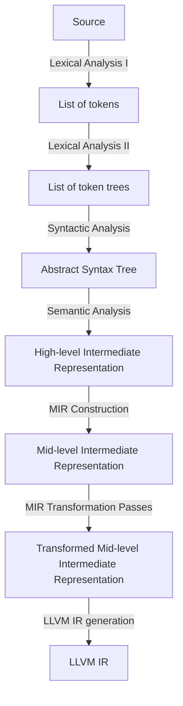

# ARCHITECTURE

- **Lexical analysis** (`front_end/lexical_analysis/`)
  - **Lexical analysis I**: the tokenizer produces a flat token list.
  - **Lexical analysis II**: the token tree parser groups tokens by delimiters. Token trees exist so that delimiter balancing is validated before parsing and error recovery is bounded to delimited regions. 
  
  See [concepts/lexical-analysis.md](concepts/lexical-analysis.md).

- **Syntactic analysis** (`front_end/syntactic_analysis/`): Recursive descent with Pratt parsing for expressions. Produces an AST in SoA layout with 32-bit handles. See [concepts/syntactic-analysis.md](concepts/syntactic-analysis.md).

- **Semantic analysis** (`front_end/semantic_analysis/`): Lowers AST to a typed HIR in three phases: (1) walk the AST, build the HIR, and collect type constraints using bidirectional typing (2) solve constraints via unification (3) substitute resolved types back into the HIR. See [concepts/semantic-analysis.md](concepts/semantic-analysis.md).

- **MIR Construction** (`middle_end/function_builder.rs`): Lowers HIR to a target-independent SSA control-flow graph. Uses block parameters instead of phi nodes (following Cranelift/MLIR). SSA construction uses the Braun et al. algorithm. See [concepts/mir-construction.md](concepts/mir-construction.md).

- **MIR transformation passes** (`middle_end/`): Read-only and rewriting passes over the freshly-lowered CFG, run before codegen.
  - **Alias resolution**: flushes the temporary aliases SSA construction introduces during trivial-phi elimination
  - **Verification**: 
  - **Const checking**:
  
  See [concepts/mir-transformation-passes.md](concepts/mir-transformation-passes.md).

- **Driver** (`driver/`): orchestrates the compilation process and handles command-line arguments.

- **Common** (`common/`): Byte-range spans and interners.

- **Diagnostics** (`diagnostics/`): One diagnostic type per stage, rendered through `ariadne`.

