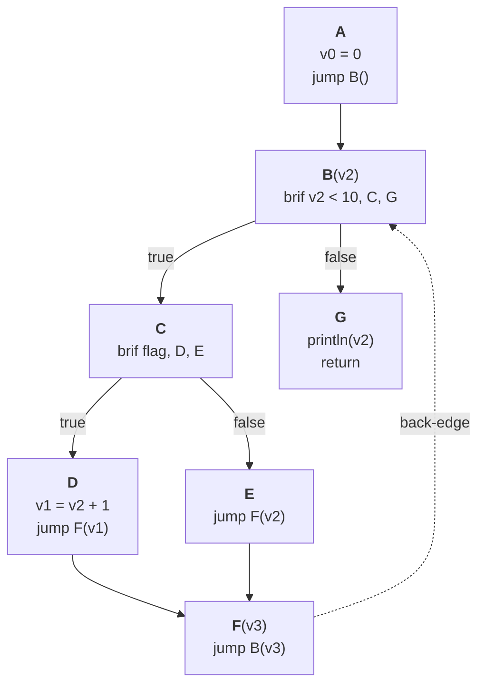

# MIR Construction

The **mid-level intermediate representation construction** stage is the stage where a single HIR function is lowered to an MIR function.

## Mid-level Intermediate Representation (MIR)

A **mid-level intermediate representation (MIR)** is an IR that retains the source language's high-level information (generics, custom attributes, direct type references) which disappears at the LLVM IR level. It is possible to convert the semantic IR (annotated AST, or HIR) to LLVM directly, but you have to do the CFG conversion anyway, and without your own IR, generic code must be checked per-instantiation rather than once, and high-level information either has no LLVM representation or must be recovered awkwardly (e.g., parsing a type's name out of the LLVM IR and looking it back up in the type interner, parsing debug info, etc.) ([source](https://www.reddit.com/r/ProgrammingLanguages/comments/1boul8y/comment/kwtxulc/?utm*source=share&utm*medium=web3x&utm*name=web3xcss&utm*term=1&utm*content=share*button)).

It is typically a collection of **functions**. A single function's body is a **control flow graph (CFG)**: a directed graph of basic blocks. 

A **basic block** is a maximal straight-line sequence of instructions such that:
- Control enters only at its first instruction, called the **entry point** (i.e., no jumps *in* the middle of the block).
- Control leaves only after its last instruction, called the **exit point** (i.e., no jumps *out* of the middle of the block). We call an exit point a **terminator** when it is required to explicitly transfer control instruction.

> [!NOTE]
> A block may have just one instruction, in which case that instruction is both the entry point and the exit point.

> [!NOTE]
> In a basic block, if any of its instruction executes, then we are certain *all* of its instructions will execute.

Abstractly, we can view basic blocks as the vertices, and the possible control-flow transfers between blocks as directed edges.

```text
         [entry]
            |
            v
        [block A]   <- "brif x > 0"
         /     \
        v       v
    [block B]  [block C]
        \       /
         v     v
        [block D]   <- merge point
```

For any block, the blocks that flow into its entry point are called **predecessors**, and those that exit from its exit point are called **successors**.

### Static Single Assignment Form

A program in **Static Single Assignment (SSA) form** has the property where every variable is assigned exactly *once*, which we call a **value**. 

It solves the issue where we cannot easily know which assignment will be used as it depends on control flow. For example:

```text
let mut x = 1;
if <condition> {
    x = 2;
}
println(x); // which x? 1 or 2?
```

In a non-SSA CFG, `print(x)` has two predecessors: one where `x` was `1`, one where `x` was `2`. 

SSA resolves this by renaming:

```text
x0 = 1
if <condition> {
    x1 = 2
}
x2 = phi(x0, x1)
println(x2)
```

Then, a **phi node** picks the values called **phi operands** from whichever predecessor was taken. This simplifies most optimization passes, since merging values at control-flow join points becomes a single lookup. 

However, phi nodes break the instruction model, as every other instruction produces its output from a local computation, but a phi node's output depends on which block jumped here, thereby forcing phi nodes to the top of the block and creates a special case every pass must handle.

Instead of the traditional phi nodes, we can use **block parameters**. Blocks have parameters so that predecessors can pass values as arguments (the equivalent of a phi operands) when they jump. 

```text
block_A:
    brif condition, block_B(), block_C()

block_B:
    jump block_D(x1)    <- pass x1

block_C:
    jump block_D(x0)    <- pass x0

block_D(x2):            <- x2 is a block parameter, defined here
    call println(x2)
    return
```

#### Values

Every SSA value has a type and a `ValueDefinition` recording where it was defined:
- `ValueDefinition::Result(InstructionId, index)`: the value is the `index`-th result of an instruction
- `ValueDefinition::Parameter(BlockId, index)`: the value is the `index`-th parameter of a block (the SSA equivalent of a phi node)

Wherever the MIR needs a variable-length run of `ValueId`s (block parameters, call arguments, branch arguments, instruction results), it uses a `ValueList`: a 4-byte `Copy` handle into a `ValueListSubAllocator`.

## SSA Constructor

The [initial SSA construction algorithm](https://dl.acm.org/doi/pdf/10.1145/75277.75280) accepts a CFG as input, and works as follows:
1. Computes for every block $X$ in the CFG its **dominance frontier** $DF$. A dominance frontier is the set of all blocks $Y$ where $X$ dominates one of its predecessors, *but* $X$ does *not* dominate $Y$. 

For instance: in the following CFG, $DF(B) = {D}$ (i.e., the dominance frontier of block $B$ is only $D$) since $D$'s predecessor $E$ is dominated by $B$, yet $B$ does not dominate $D$ since there's a path to $D$ from $C$.

```text
   / \
  B   C
  |   |
  E   |
   \ /
    D
```

2. For each variable, find every block that contains an assignment of it, union their dominance frontiers, then put a φ-node in each block of that union. This is because every block in a dominance frontier is a merge point! 

> [!NOTE]
> Facts about dominances
> - A block $A$ is said to dominate a block $B$ if every path from the entry block of the CFG to block $B$ passes through block $A$. A block $A$ strictly dominates a block $B$ if the block $A$ dominates block $B$ and $A \neq B$
> - Every block dominates (but does not strictly dominate) itself.

This indicates where to create and insert phi nodes.

3. Rename variables to ensure SSA's single assignment property is satisfied.

However, Cytron et al.'s algorithm pays two costs before a single phi node is placed: the AST must already be lowered to a CFG, and the dominance frontier (typically alongside the dominator tree) must be computed for the *entire* CFG upfront, regardless of how many variables actually need phi nodes. 

This is where [Braun et al.'s algorithm](https://link.springer.com/chapter/10.1007/978-3-642-37051-9_6) comes in. It lowers straight from the typed IR to SSA (skipping the dominance frontier analysis entirely from Cytron et al.'s algorithm), by placing phi nodes lazily via recursion instead of computing them all upfront:
- Base Case (**Local value numbering**): check if the variable was already assigned earlier in the same block, and if so, just reuse that value directly (since there's only ever one possible path that led to that assignment executing: the one you're already on)
- Recursive Step (**Global value numbering**): if a block currently contains no definition for a variable, we recursively look for a definition in its predecessors. Which of three cases applies depends on the block's sealed status and predecessor count:
    - **Unsealed** (not all predecessors known yet): create an empty phi node for this block as a placeholder.

    > [!NOTE]
    > Sealing (`declare_block` then, later, `seal_block`) is an explicit, caller-driven action: seal a block the moment its predecessor set is final. Most blocks know that upfront and seal immediately; loop headers don't, since the back-edge doesn't exist until the whole body is lowered, so sealing waits until then.

    - **Sealed, single predecessor**: skip creating a phi node entirely, and just query that one predecessor recursively for a definition instead since there's only one possible path into this block, and so there's nothing to merge.
    - **Sealed, multiple predecessors**: create an empty phi node for this block first to prevent infinite recursion (the placeholder is what a reentrant lookup for the same block finds instead of recursing forever, breaking the cycle), record it as the current definition for the variable in the block, then recurse into every predecessor and ask each for their value.
        - If all predecessors give the same value: no phi node is needed at all. That single value is the answer, and just hand it back up.
        - If the predecessors give different values: that disagreement means this block is a genuine merge point, so the placeholder phi node's operands get filled in, one operand per predecessor, matching each predecessor's value to its corresponding edge. The phi node's result value becomes the answer.
        - Then, check whether that phi node is *trivial* i.e., if its operands, once filled in, all turn out to be the same value (ignoring any operand that just points back to the phi node itself), and thus, not merging anything. This phi node is therefore removed, and every use of it is replaced with that shared value directly. Additionally, a phi node is considered trivial if the phi node has no operands besides itself, it means that it can't actually be reached with from any predecessor (i.e., it's either dead/unreachable code, or it's the function's entry block, as the entry block has no predecessors at all) either unreachable or in the start block. Since there's nothing sensible to substitute, we plug in an explicit **undefined** placeholder value as the phi node's replacement, so it takes the phi node's place wherever the phi was already being used. 

        > [!NOTE]
        > This fill-then-check order only stays cheap for classical phi nodes whose operands live on the phi node itself. For **block parameters**, operands instead live on each predecessor's jump or branch instruction as block arguments, so filling them in *before* checking triviality means a trivial result leaves the block's parameter count out of sync with its predecessors' argument count, forcing the one argument added to be stripped back out of every predecessor. Cranelift avoids this by checking triviality first, before writing any arguments, and only committing them once a parameter is known to survive (i.e., there's no process of removing block arguments).

        > [!NOTE]
        > It is necessary to *recursively* remove trivial phi nodes as other phi nodes elsewhere may hold the now-deleted trivial phi node as one of their operands. Once that operand is rewritten to the common value $v$, those phis' operand lists change too, which can newly make *them* trivial so the check has to cascade to every user of the removed phi, and not *just* the phi itself. However, this code doesn't do that, but only **aliases** trivial block parameters, then rewrites them once, in a single batch at the end of construction (`flush_aliases()`). 

> [!NOTE]
> Since this Braun et al's algorithm doesn't build a dominance frontier, any later pass that may require one (e.g. loop-invariant code motion, contification) must compute it separately, which isn't much different than the upfront dominance frontier compute cost of Cytron et al. algorithm.

> [!NOTE]
> Braun et al.'s algorithm also enables on-the-fly local optimizations (constant folding, copy propagation, common subexpression elimination) during construction, since values are built incrementally anyway.

[source](https://www.cs.cornell.edu/courses/cs6120/2025sp/blog/efficient-ssa/) 

## Lowerer

The **lowerer** is responsible for walking the HIR, taking every HIR function, and producing an MIR function. While lowering the HIR function to a CFG, it calls the  `SsaConstructor` to enforce the SSA form. Once an HIR function is fully lowered, the Lowerer calls `flush_aliases()` on the finished `Cfg` to resolve anything `SsaConstructor` deferred during trivial block-parameter elimination.

### Control Flow

#### If expressions

**If with else:**

```text
                [condition block]
       cond. branch /        \
                   /          \
          [then block]   [else block]
               \               /
           jump \             / jump
                [merge block]
```

**If without else:**

```text
                [condition block]
       cond. branch /        \
                   /          \
          [then block]        /  cond. branch
               \             /
           jump \           /
                [merge block]
```

**Short-circuiting expressions**

```text
             [lhs block]
cond. branch /        \
            /          \
     [rhs block]       /  cond. branch
          \           /
      jump \         /
          [merge block]
```

#### Loops

```text
[pre-loop block]
               |
             jump
               v
        [body block] <---------+
          |          \         |
     (break; N times)  \    back-edge
          |              \     |
          v                +---+
     [exit block]
```

Consider the following crawfish program, which reads `x` in the loop condition itself so the walkthrough actually exercises the unsealed/deferred case, not just the sealed one:

```
func example(flag: bool) {
    let x = 0;
    while x < 10 {
        if flag {
            x = x + 1;
        }
    }
    println(x);
}
```



This lowers to seven blocks: $A$ (before the loop), $B$ (the while header, evaluating `x < 10`), $C$ (the loop body's entry, evaluating `flag`), $D$ (the `if`'s true branch, `x = x + 1`), $E$ (the `if`'s false/skip path), $F$ (the `if`'s merge point, which is also the loop body's tail), and $G$ (after the loop, `println(x)`).

1. In block $A$, `let x = 0;` is a simple assignment, recorded as `v0`. Create block $B$, jump $A \to B$, and register that jump as $B$'s first predecessor. $B$ cannot be sealed yet, its second predecessor (the back-edge from $F$) doesn't exist.
2. Lowering $B$'s own condition (`x < 10`) requires reading `x` in $B$. $B$ is unsealed, so this is the **Unsealed** case: create an empty, placeholder block parameter for $B$, labeled $v2$, record it as $B$'s local definition of `x`, and hand it back as the answer *without* filling in any operands yet.
3. Build the branch `brif (v2 < 10), C, G`. Create and seal $C$ and $G$ immediately, each has exactly one, already-known predecessor (this branch).
4. In $C$, lower `flag` (unrelated to `x`), then branch to $D$ or $E$. Create and seal both immediately, same reasoning as step 3.
5. In $D$, `x = x + 1;` is recorded as `v1`. Jump $D \to F$. In $E$, nothing happens; jump $E \to F$.


6. Create $F$. Register both $D$'s and $E$'s jumps as its two predecessors, this is $F$'s complete predecessor set (nothing else in the program can ever add a third), so seal $F$ immediately.
7. To build $F$'s own back-edge (`jump B(..)`), we first need `x`'s value in $F$: read `x` in $F$. $F$ is sealed with two predecessors, so this is the **cycle-breaking** case (not the Unsealed one, $F$ is already sealed): create an empty placeholder $v3$, register it as $F$'s local definition, then recurse into $D$ and $E$.
8. In $D$, the local definition $v1$ (from step 5) is returned directly, becoming $v3$'s first operand. In $E$, there's no local definition, but exactly one predecessor ($C$), so we recurse into $C$ without creating a phi node; $C$ has no local definition either, with exactly one predecessor ($B$), so we recurse once more into $B$.
9. In $B$, we find the local definition $v2$, created back in step 2. Had that placeholder not already existed, this would recurse infinitely ($B \to F \to E \to C \to B \to \ldots$). $v2$ is returned back up through $C$ and $E$, becoming $v3$'s second operand: $v3 = \varphi(v1, v2)$.


10. $F$'s back-edge is now built as `jump B(v3)`, passing $v3$ as $B$'s block argument. Register this jump as $B$'s second predecessor. $B$'s predecessor set is finally complete, **seal $B$**, this is the moment $v2$'s placeholder from step 2 actually gets resolved: `collect_block_arguments` reads `x` from each of $B$'s predecessors, `v0` from $A$'s edge and `v3` from $F$'s edge, giving $v2 = \varphi(v0, v3)$.


11. In $G$, `println(x)` reads `x`. $G$ is sealed with exactly one predecessor ($B$), so we recurse into $B$ without creating a phi node, finding the now-resolved $v2$ directly: `println(v2)`.


